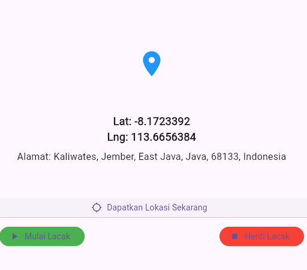

# Laporan: Praktikum Geolocation (flutter_new12)

Dokumentasi singkat mengenai perubahan dan pengujian fitur geolocation/reverse-geocoding pada proyek `flutter_new12`.

## Tujuan
- Memperbaiki error "Unexpected null value" saat menampilkan alamat dari reverse-geocoding.
- Menambahkan fallback reverse-geocoding menggunakan Nominatim (OpenStreetMap) bila plugin `geocoding` tidak memberikan hasil lengkap.
- Memberikan pesan fallback yang ramah pengguna (mis. menampilkan koordinat jika alamat tidak tersedia).


## Cara menjalankan (lokal)
1. Pastikan dependency `geolocator, geocoding, google_maps_fluttrtr` ada pada `pubspec.yaml`. Jika belum ada, tambahkan:
# Laporan Praktikum: Geolocation (flutter_new12)

Nama: Ahmad Bachtiar Raflyansyah
Mata Praktikum: Pemrograman Mobile
Tanggal: 10 nvember 2025

Deskripsi singkat
Saya membuat perbaikan pada fitur geolocation di aplikasi sederhana ini. Tujuan utamanya adalah memastikan aplikasi tidak crash saat mencoba menampilkan alamat (reverse-geocoding) dan menambahkan sumber fallback bila data alamat tidak lengkap.

Langkah yang saya lakukan
- Mengamati masalah: aplikasi kadang menampilkan "Unexpected null value" saat mengakses field alamat.
- Memperbaiki fungsi reverse-geocoding agar aman terhadap nilai null.
- Menambahkan panggilan ke layanan Nominatim (OpenStreetMap) sebagai fallback jika plugin `geocoding` tidak mengembalikan hasil memadai.
- Menambahkan pesan fallback yang menampilkan koordinat jika tidak ada alamat.

# Hasil


- Setelah perubahan, aplikasi menampilkan alamat dengan lebih andal. Contoh hasil untuk koordinat yang diuji:
  - Lat: -8.2941983, Lng: 114.3072228
  - Alamat (Nominatim): Labansukadi, Labanasem, Banyuwangi, East Java, Indonesia


Cara menjalankan (singkat)
1. Pastikan dependency di `pubspec.yaml` (misalnya `geolocator`, `geocoding`) lalu jalankan:

```bash
flutter pub get
flutter run
```

2. Di aplikasi: tekan "Dapatkan Lokasi Sekarang" atau "Mulai Lacak".


## KESIMPULAN

Pada praktikum ini berhasil diterapkan fitur geolocation dan reverse-geocoding menggunakan Flutter. Error null pada hasil geocoding berhasil diatasi dengan mekanisme fallback menggunakan API Nominatim serta penambahan validasi dan pesan ramah pengguna. Aplikasi dapat tetap memberikan informasi lokasi meskipun layanan geocoding utama mengalami kendala. Hal ini menunjukkan bahwa penerapan error handling dan fallback server pada aplikasi berbasis lokasi sangat penting untuk menjaga kehandalan aplikasi di dunia nyata.


